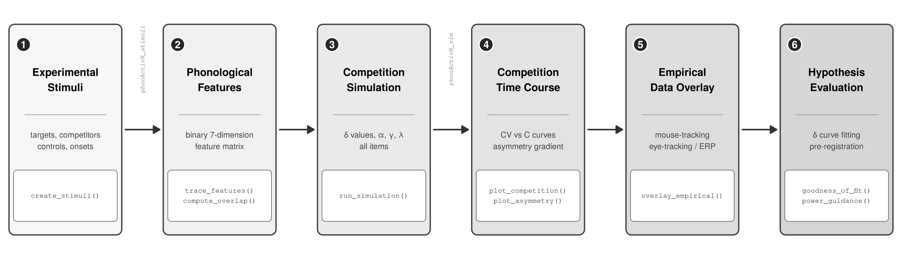

# phonActivR 

[](https://opensource.org/licenses/MIT)
[](https://cran.r-project.org/)

**An R package for simulating and testing prosodic-constraint (delta) hypotheses in cross-linguistic spoken word recognition**

## Authors

- **Yu-Cheng Lin** — Department of Psychological Science, University of Texas Rio Grande Valley
- **Hitomi Kambara** — Department of Bilingual and Literacy Studies, University of Texas Rio Grande Valley

## Overview

`phonActivR` is a pure-R package that implements a compact lateral-inhibition competition model in the interactive-activation family (not TRACE; see NEWS for the explicit omission list). It provides an architecture for generating predictions about phonological competition in spoken word recognition. It requires no Java or external software.

### Key Features

- **δ (delta) parameter**: Operationalizes cross-linguistic prosodic processing constraints (e.g., moraic, syllabic) as temporal delays on sub-unit activation, providing a unified framework for testing cross-linguistic processing hypotheses.
- **Item-level simulation**: Runs across full experimental stimulus sets (not just single words), with automatic phonological overlap computation from a binary adaptation, constructed by the package authors, of the seven McClelland–Elman (1986) feature dimensions (used as a similarity metric only; see `?trace_features`).
- **Paradigm-agnostic overlay**: Normalizes and superimposes model predictions onto empirical time-course data from mouse-tracking, eye-tracking, ERP, or any paradigm producing a time-varying competition measure.
- **Multi-level validation**: Qualitative cohort/rhyme benchmarks, systematic parameter sensitivity analysis, parameter recovery, and AIC-based model selection.
- **Publication-ready figures**: All visualizations are ggplot2 objects, customizable with standard ggplot2 grammar.

## Installation

```r
# Install from GitHub (build_vignettes = TRUE makes the tutorial vignette
# available via vignette("phonActivR-tutorial"))
install.packages("devtools")
devtools::install_github("yclinpsy/phonActivR", build_vignettes = TRUE)
```

No Java, Python, or external software required. Help pages for every
exported function are available in the usual way (e.g., `?run_simulation`,
`?custom_similarity`).

## Quick Start

```r
library(phonActivR)
stim <- example_stimuli_jp()                              # Load built-in 42-item stimulus set
sim  <- run_simulation(stim, delta_values = c(0,10,20,30)) # Run simulation
plot_asymmetry(sim)   # the primary hypothesis-adjudication figure                                      # Visualize predictions
overlay_empirical(sim, example_empirical(sim))             # Overlay synthetic empirical data
```

## Tutorial

A comprehensive step-by-step tutorial is available as a package vignette:

```r
vignette("phonActivR-tutorial")
```

The tutorial demonstrates the complete workflow from stimulus specification through simulation, visualization, and empirical comparison, illustrated with a worked example from a Japanese–English bilingual spoken word recognition study.

## Reproducing Paper Figures

All figures in the accompanying *Behavior Research Methods* tutorial paper can be reproduced:

```r
source(system.file("extdata", "generate_figures.R", package = "phonActivR"))
```

All scripts use `set.seed(1234)` for exact reproducibility.

## Functions

Complete inventory of the exported functions (see each function's help page,
e.g. `?run_simulation`, for details):

| Function | Purpose |
|----------|---------|
| `trace_features()` | Binary adaptation of the McClelland–Elman (1986) feature dimensions (similarity metric only; see `?trace_features` for provenance) |
| `phoneme_similarity()` | Feature-based (or custom) phoneme-pair similarity |
| `custom_similarity()` | Build a similarity lookup from user-entered pairwise values (cross-linguistic use) |
| `check_phoneme_coverage()` | Report stimulus phonemes not covered by the active feature/similarity set |
| `compute_overlap()` | Word-level phonological overlap (C, CV, CVC, syllable) |
| `run_activation()` | Single competitor–control pair activation dynamics |
| `run_item()` | Single-item two-condition (larger/smaller grain) simulation |
| `find_onset()` | Competition-onset detection on an effect curve |
| `create_stimuli()` | Organize stimulus sets with onset transcriptions |
| `run_simulation()` | Run interactive activation model across items and δ values |
| `plot_competition()` | Competition effect curves for competing hypotheses |
| `plot_asymmetry()` | CV–C asymmetry gradient (primary hypothesis-adjudication figure) |
| `plot_onset_timing()` | Predicted competition onset as a function of δ |
| `theme_phonactivr()` | Publication ggplot2 theme shared by all package figures (usable on any plot) |
| `phonactivr_colors()` | Colorblind-safe Okabe–Ito categorical palette used across all figures |
| `overlay_empirical()` | Overlay empirical data onto model predictions; `fit = TRUE` annotates the AIC-selected best δ |
| `example_stimuli_jp()` | Built-in 42-item Japanese–English stimulus set |
| `example_empirical()` | Generate synthetic empirical data (paradigm-specific noise defaults) |
| `example_gamm` (data) | Bundled GAMM-format dataset; `data(example_gamm)` |
| `export_results()` | Save simulation output to CSV |
| `power_guidance()` | Estimate minimum detectable δ difference |
| `sensitivity_analysis()` | Multi-parameter robustness analysis |
| `parameter_recovery()` | Recover known δ from synthetic data |
| `cohort_rhyme_benchmark()` | Qualitative cohort/rhyme benchmark validation |
| `goodness_of_fit()` | AIC-based model comparison (group-aware; `time_window` robustness checks) |
| `compare_languages()` | Cross-linguistic grain-size comparison |

## Citation

If you use phonActivR in your research, please cite:

> Lin, Y.-C., & Kambara, H. (2026). phonActivR: An R package for simulating and testing prosodic-constraint (delta) hypotheses in cross-linguistic spoken word recognition. *Behavior Research Methods*. [Tutorial Collection]

## Related Package

[**phonSizeR**](https://github.com/yclinpsy/phonSizeR) — A companion package that computes a continuous, descriptive grain-size index (φ) directly from empirical competition data, with bootstrap confidence intervals and permutation group tests. While phonActivR generates predictions (forward simulation), phonSizeR summarizes observed data.

**Recommended workflow**: phonActivR for exploratory simulation and hypothesis generation → phonSizeR for quantitative description of the observed data.

## License

MIT License © 2026 Yu-Cheng Lin and Hitomi Kambara
